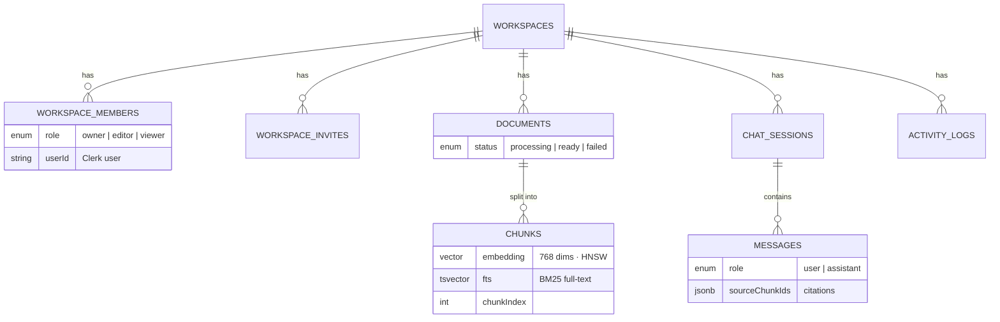

<div align="center">

# IntelliVault

**Enterprise document intelligence — workspace-scoped hybrid RAG, streaming AI chat, and team collaboration.**

[](https://nextjs.org)
[](https://typescriptlang.org)
[](https://sdk.vercel.ai)
[](https://neon.tech)
[](https://clerk.com)
[](https://openai.com)

Upload documents into isolated team workspaces. Ask questions. Get answers grounded in your organization's actual knowledge — with role-based access, source citations, session history, and full auditability.

[Why IntelliVault](#why-intellivault) · [How It Works](#how-it-works) · [RAG Pipeline](#the-rag-pipeline) · [User Flow](#user-flow) · [Tech Stack](#tech-stack) · [Getting Started](#getting-started)

</div>

---

## Why IntelliVault

Most "chat with your PDF" demos are single-user, single-document, zero access control. IntelliVault is built like a product, not a demo:

- **Workspaces** — isolated containers for documents, chats, and members. Zero cross-tenant data access.
- **Role-based access** — Owner / Editor / Viewer roles enforced at the API layer on every route.
- **Hybrid retrieval** — vector search *and* keyword search fused together, so it finds both *meanings* and *exact terms*.
- **Grounded answers** — the AI only answers from your documents, with source citations on every response.
- **Persistent sessions** — conversations saved, titled automatically, and resumable from history.

---

## Features

| Feature | Description |
|---|---|
| **Workspace isolation** | Documents, chats, and members scoped per workspace — no cross-tenant leakage |
| **RBAC** | Owner / Editor / Viewer roles enforced on every API route |
| **Document ingestion** | PDF upload → extraction → chunking → embedding → indexed storage |
| **Hybrid RAG search** | pgvector semantic search + Postgres BM25 full-text search, merged with Reciprocal Rank Fusion |
| **Tool-calling agent** | The LLM autonomously decides when to search the knowledge base |
| **Source citations** | Every answer shows which documents and chunks backed it |
| **Session persistence** | Conversations saved to DB, titled by LLM, resumable from history |
| **Email invites** | Invite collaborators by email — works with or without an existing account |
| **Streaming responses** | Token-by-token streaming via Vercel AI SDK |
| **Audit logging** | Every workspace action logged with actor, timestamp, and metadata |

---

## How It Works

IntelliVault has two halves: an **ingestion pipeline** that turns raw PDFs into searchable knowledge, and a **retrieval pipeline** that answers questions from that knowledge. Both are scoped to a workspace at every step.

```mermaid
%%{init: {"theme":"base","themeVariables":{"fontFamily":"Inter, Segoe UI, sans-serif","fontSize":"13px","primaryColor":"#101113","primaryTextColor":"#e6e8ea","primaryBorderColor":"#2b2e34","lineColor":"#5a5f68","clusterBkg":"#0b0c0e","clusterBorder":"#1f2126","edgeLabelBackground":"#0b0c0e","titleColor":"#9ba1a6"},"flowchart":{"curve":"basis","nodeSpacing":38,"rankSpacing":46}}}%%
flowchart LR
    subgraph W ["  ingestion · write path  "]
        direction LR
        A(["PDF upload"]) --> B["extract &amp; chunk"] --> C["embed + index"]
    end

    C --> D[("knowledge base<br/><i>pgvector · tsvector</i>")]

    subgraph R ["  retrieval · read path  "]
        direction LR
        E(["user question"]) --> F["hybrid search"] --> G["LLM synthesis"] --> H(["cited, streamed answer"])
    end

    D -. "workspace-scoped chunks" .-> F

    classDef entry stroke:#5e6ad2,stroke-width:1.5px
    classDef store fill:#15161b,stroke:#5e6ad2,stroke-width:1.5px
    classDef exit stroke:#3dd68c,stroke-width:1.5px
    class A,E entry
    class D store
    class H exit
```



---

## The RAG Pipeline

### 1 · Ingestion — documents in

Every uploaded PDF goes through this pipeline before it becomes searchable. Two indexes are built per chunk: a **768-dim embedding** (for meaning) and a **tsvector** (for exact keywords).

```mermaid
%%{init: {"theme":"base","themeVariables":{"fontFamily":"Inter, Segoe UI, sans-serif","fontSize":"13px","primaryColor":"#101113","primaryTextColor":"#e6e8ea","primaryBorderColor":"#2b2e34","lineColor":"#5a5f68","edgeLabelBackground":"#0b0c0e"},"flowchart":{"curve":"basis","nodeSpacing":42,"rankSpacing":52}}}%%
flowchart TD
    A(["PDF upload"]) --> B["text extraction<br/><i>unpdf</i>"]
    B --> C["chunking<br/><i>1000 chars · 200 overlap</i>"]
    C --> D["semantic index<br/><i>Gemini embedding · 768 dims</i>"]
    C --> E["keyword index<br/><i>Postgres tsvector</i>"]
    D --> F[("chunks<br/><i>pgvector · HNSW</i>")]
    E --> F
    F --> G(["document ready"])

    classDef entry stroke:#5e6ad2,stroke-width:1.5px
    classDef store fill:#15161b,stroke:#5e6ad2,stroke-width:1.5px
    classDef exit stroke:#3dd68c,stroke-width:1.5px
    class A entry
    class F store
    class G exit
```



### 2 · Retrieval — answers out

When a user asks a question, **two retrievers run in parallel** and their results are fused. Each is good at what the other is bad at:

| Retriever | Finds | Example |
|---|---|---|
| **Vector search** | Meaning & paraphrases | "car" ≈ "automobile", "leave policy" ≈ "vacation rules" |
| **BM25 full-text** | Exact tokens | policy codes (`POL-SEC-014`), names, IDs, clause numbers |
| **RRF fusion** | Best of both | chunks that *both* retrievers rank highly float to the top |

```mermaid
%%{init: {"theme":"base","themeVariables":{"fontFamily":"Inter, Segoe UI, sans-serif","fontSize":"13px","primaryColor":"#101113","primaryTextColor":"#e6e8ea","primaryBorderColor":"#2b2e34","lineColor":"#5a5f68","edgeLabelBackground":"#0b0c0e"},"flowchart":{"curve":"basis","nodeSpacing":42,"rankSpacing":50}}}%%
flowchart TD
    A(["user question"]) --> B["LLM agent<br/><i>decides to search</i>"]
    B --> C["searchKnowledgeBase"]

    C --> D["vector search<br/><i>cosine similarity · top 20</i>"]
    C --> E["BM25 full-text<br/><i>ts_rank · top 20</i>"]

    W["workspace_id filter<br/><i>tenant isolation</i>"] -.- D
    W -.- E

    D --> F["reciprocal rank fusion<br/><i>Σ 1 / (60 + rank) → top 5</i>"]
    E --> F

    F --> G["LLM synthesis<br/><i>grounded in chunks only</i>"]
    G --> H(["streamed answer + citations"])
    H --> I[("session history")]

    classDef entry stroke:#5e6ad2,stroke-width:1.5px
    classDef fuse fill:#15161b,stroke:#5e6ad2,stroke-width:1.5px
    classDef guard fill:transparent,stroke:#2b2e34,stroke-dasharray:4 3,color:#9ba1a6
    classDef exit stroke:#3dd68c,stroke-width:1.5px
    classDef store fill:#15161b,stroke:#2b2e34
    class A entry
    class F fuse
    class W guard
    class H exit
    class I store
```



> **Why hybrid?** Pure vector search misses rare terms, IDs, and exact names. Pure keyword search has no idea two words mean the same thing. Fusing both ranked lists with RRF means a chunk that both retrievers like is almost certainly the right one.

---

## User Flow

The full journey from sign-up to a cited answer:

```mermaid
%%{init: {"theme":"base","themeVariables":{"fontFamily":"Inter, Segoe UI, sans-serif","fontSize":"13px","primaryColor":"#101113","primaryTextColor":"#e6e8ea","primaryBorderColor":"#2b2e34","lineColor":"#5a5f68","edgeLabelBackground":"#0b0c0e","clusterBkg":"#0b0c0e","clusterBorder":"#1f2126","titleColor":"#9ba1a6"},"flowchart":{"curve":"basis","nodeSpacing":40,"rankSpacing":48}}}%%
flowchart LR
    A(["sign in<br/><i>Clerk</i>"]) --> B["dashboard"]
    B --> C{"workspace"}
    C -- create --> D["new workspace<br/><i>owner</i>"]
    C -- invited --> E["accept invite<br/><i>editor · viewer</i>"]
    D --> F["workspace home"]
    E --> F

    subgraph K ["  knowledge  "]
        direction TB
        G["upload PDF"] --> G2["auto-indexed<br/><i>processing → ready</i>"]
    end

    subgraph T ["  chat loop  "]
        direction TB
        H["ask question"] --> H2["hybrid RAG search"] --> H3(["cited answer"])
        H3 -. "follow-up" .-> H
    end

    F --> K
    F --> T
    G2 -. "knowledge available" .-> H2
    H3 --> I[("session history<br/><i>resumable</i>")]

    classDef entry stroke:#5e6ad2,stroke-width:1.5px
    classDef hub fill:#15161b,stroke:#5e6ad2,stroke-width:1.5px
    classDef exit stroke:#3dd68c,stroke-width:1.5px
    classDef store fill:#15161b,stroke:#2b2e34
    class A entry
    class F hub
    class H3 exit
    class I store
```



Members and settings round out the workspace: invite collaborators by email with a role, rename the workspace, or delete it behind a type-to-confirm danger zone — every action written to the audit log.

---

## Data Model



All workspace-child tables **cascade-delete** when the parent workspace is removed.

---

## Tech Stack

| Layer | Technology |
|---|---|
| Framework | Next.js 16 (App Router) · TypeScript 5 |
| Auth | Clerk |
| Database | Neon serverless PostgreSQL |
| Vector search | pgvector — cosine similarity + HNSW index |
| Keyword search | Postgres full-text search (`tsvector` / `ts_rank`) |
| ORM | Drizzle ORM |
| Embeddings | Google Gemini `gemini-embedding-001` (768 dims) |
| LLM | OpenAI `gpt-4o-mini` via Vercel AI SDK v6 |
| PDF parsing | unpdf |
| Text splitting | LangChain `RecursiveCharacterTextSplitter` |
| Email | Resend + React Email |
| Styling | Tailwind CSS v4 · Linear-inspired design system |

---

## Getting Started

### Prerequisites

- Node.js 20+
- [Neon](https://neon.tech) database with the `pgvector` extension
- [Clerk](https://clerk.com) application
- [OpenAI](https://platform.openai.com) API key
- [Google AI Studio](https://aistudio.google.com) API key (embeddings)
- [Resend](https://resend.com) API key (invites)

### 1 · Clone & install

```bash
git clone https://github.com/itsyashbisht/IntelliVault-Enterprise.git
cd IntelliVault-Enterprise
npm install
```

### 2 · Environment variables

Create `.env.local`:

```env
# Database
NEON_DATABASE_URL=postgresql://...

# Auth
NEXT_PUBLIC_CLERK_PUBLISHABLE_KEY=pk_test_...
CLERK_SECRET_KEY=sk_test_...

# AI
OPENAI_API_KEY=sk-...
GOOGLE_GENERATIVE_AI_API_KEY=AIza...

# Email
RESEND_API_KEY=re_...
NEXT_PUBLIC_APP_URL=http://localhost:3000
```

### 3 · Database setup

```sql
-- Run once in the Neon SQL editor
CREATE EXTENSION IF NOT EXISTS vector;

CREATE TYPE workspace_role AS ENUM ('owner', 'editor', 'viewer');
CREATE TYPE invite_status AS ENUM ('pending', 'accepted', 'expired');
CREATE TYPE document_status AS ENUM ('processing', 'ready', 'failed');
CREATE TYPE message_role AS ENUM ('user', 'assistant');
```

```bash
npx drizzle-kit push
```

### 4 · Run

```bash
npm run dev
```

Open [http://localhost:3000](http://localhost:3000) — sign up, create a workspace, upload a PDF, and start asking questions.

---

## API Routes

| Route | Methods | Access |
|---|---|---|
| `/api/workspaces` | `POST` `GET` | Authenticated |
| `/api/workspaces/[id]` | `GET` `PATCH` `DELETE` | Member / Owner |
| `/api/workspaces/[id]/members` | `GET` `PATCH` `DELETE` | Member / Owner |
| `/api/workspaces/[id]/invites` | `POST` `GET` `DELETE` | Owner / Editor |
| `/api/workspaces/[id]/documents` | `POST` `GET` | Member |
| `/api/workspaces/[id]/documents/[docId]` | `DELETE` | Owner / Editor |
| `/api/workspaces/[id]/chat` | `POST` | Member |
| `/api/workspaces/[id]/chat/sessions` | `POST` `GET` | Member |
| `/api/invites/[token]` | `POST` | Authenticated |

---

## Project Structure

```
src/
├── app/
│   ├── (marketing)/          # Landing, sign-in, sign-up
│   ├── (app)/
│   │   ├── dashboard/        # Workspace switcher
│   │   └── workspace/[id]/
│   │       ├── documents/    # Upload + document list
│   │       ├── chat/         # RAG chat + session history
│   │       ├── members/      # Member management + invites
│   │       └── settings/     # Rename + danger zone
│   └── api/                  # Workspace, document, chat, invite routes
├── components/
│   ├── documents/            # UploadDropzone, DocumentTable, StatusBadge
│   ├── workspace-home/       # StatsCard, RecentDocuments, RecentChats
│   └── ai-elements/          # Chat UI primitives
├── schema/                   # Drizzle table definitions + relations
├── lib/
│   ├── search.ts             # Hybrid search: vector + BM25 + RRF fusion
│   ├── embedding.ts          # Gemini embedding generation
│   └── chunking.ts           # LangChain text splitter
└── emails/                   # React Email templates
```

---

## Roadmap

- [x] **Hybrid search** — pgvector + BM25 full-text, fused with Reciprocal Rank Fusion ✅ *shipped*
- [ ] **Query rewriting** — rewrite follow-up questions into standalone queries using conversation history (fixes "it" / "that" retrieval failures)
- [ ] **Contextual chunking** — prepend document title + section heading to each chunk before embedding
- [ ] **Re-ranking** — cross-encoder re-ranker on retrieved chunks for better precision
- [ ] **LLM-as-judge evaluation** — score responses on faithfulness and relevance, surfaced in a workspace analytics dashboard

---

## License

Private project. All rights reserved.

---

<div align="center">

Built by [Yash Bisht](https://github.com/itsyashbisht) · Next.js · pgvector · GPT-4o-mini · Gemini · Vercel AI SDK

</div>
