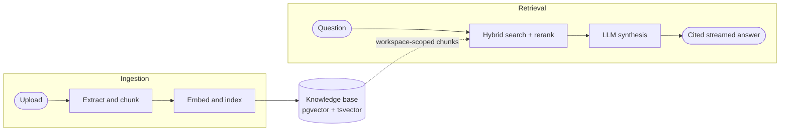
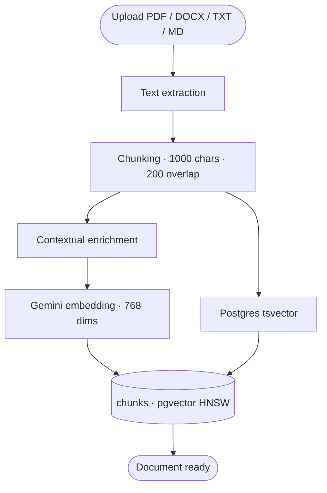
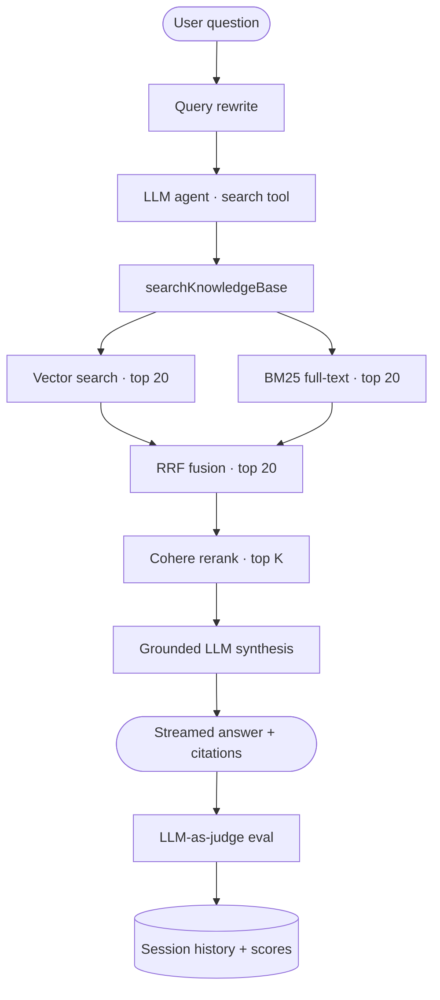
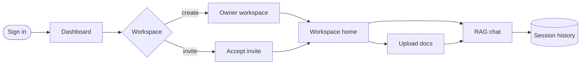
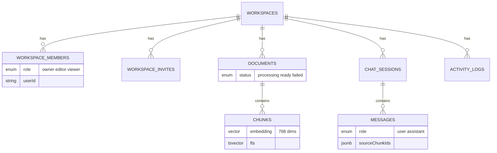

<div align="center">

# IntelliVault

### Enterprise document intelligence for teams

Upload documents. Ask questions. Get precise, cited answers — grounded in your organization's knowledge, isolated by workspace, and secured with role-based access.

<br />

[](https://nextjs.org)
[](https://www.typescriptlang.org)
[](https://neon.tech)
[](https://clerk.com)
[](https://openai.com)
[](https://cohere.com)
[](https://sdk.vercel.ai)

<br />

[Getting Started](#getting-started) · [Architecture](#architecture) · [Tech Stack](#tech-stack) · [API](#api-routes)

</div>

---

## Overview

IntelliVault is a workspace-scoped RAG platform for teams that need document Q&A with real product constraints: multi-tenancy, access control, citations, and evaluation — not a single-user PDF chatbot.

| Challenge                            | How IntelliVault solves it                                                     |
| ------------------------------------ | ------------------------------------------------------------------------------ |
| Cross-tenant data risk               | **Workspaces** isolate documents, chats, and members                           |
| Uncontrolled access                  | **RBAC** — Owner / Editor / Viewer, enforced on every API route                |
| Missed exact terms or weak semantics | **Hybrid retrieval** — vector + BM25, fused with RRF, then Cohere rerank       |
| Hallucinated answers                 | **Grounded generation** with source citations on every response                |
| Lost conversations                   | **Persistent sessions** — saved, auto-titled, and resumable                    |
| No quality signal                    | **LLM-as-judge eval** — relevance, faithfulness, and answer quality dashboards |

---

## Demo

> Demo video coming soon.

<!--
Replace with your recording when ready:

<a href="YOUR_DEMO_LINK">
  
</a>
-->

**Try the flow:** sign up → create a workspace → upload a PDF → ask a question → inspect citations and eval scores.

---

## Product Features

### Workspaces & collaboration

- Isolated workspaces for documents, chats, members, and activity
- Invite collaborators by email (works with or without an existing account)
- Owner / Editor / Viewer roles enforced at the API layer
- Audit log for workspace actions

### Document intelligence

- Multi-format ingestion: PDF, DOCX, TXT, Markdown
- Automatic parse → chunk → embed → index pipeline
- Contextual chunking (document name + section heading) for better retrieval
- Status tracking: processing → ready / failed

### Chat & retrieval

- Streaming RAG chat powered by Vercel AI SDK
- Query rewriting for conversational follow-ups
- Hybrid search: pgvector + Postgres BM25
- Reciprocal Rank Fusion + Cohere reranking for precision
- Source citations on assistant responses
- Session history with LLM-generated titles

### Quality & operations

- Per-response LLM-as-judge scores (context relevance, faithfulness, answer relevance)
- Workspace eval dashboard for owners and editors
- Toast feedback for key user actions
- Responsive workspace UI (mobile drawer nav, full-width chat)

---

## Architecture

IntelliVault has two paths: **ingestion** (write) and **retrieval** (read). Both are workspace-scoped end to end.



### Ingestion pipeline



### Retrieval pipeline



| Stage             | Purpose                                                     |
| ----------------- | ----------------------------------------------------------- |
| **Vector search** | Meaning and paraphrases (`leave policy` ≈ `vacation rules`) |
| **BM25**          | Exact tokens, IDs, policy codes, names                      |
| **RRF**           | Fuse ranked lists so agreement rises to the top             |
| **Cohere rerank** | Cross-encode query vs candidates for final precision        |

---

## User Flow

1. **Sign in** with Clerk
2. **Create or join** a workspace from the dashboard
3. **Upload documents** — indexing runs automatically
4. **Chat** — ask questions, follow up, resume sessions
5. **Collaborate** — invite members, manage roles, review eval scores



---

## Data Model



Deleting a workspace cascade-deletes its children.

---

## Tech Stack

| Layer      | Technology                                              |
| ---------- | ------------------------------------------------------- |
| App        | Next.js 16 (App Router), TypeScript 5                   |
| Auth       | Clerk                                                   |
| Database   | Neon PostgreSQL + pgvector                              |
| ORM        | Drizzle                                                 |
| Embeddings | Google Gemini `gemini-embedding-001` (768 dims)         |
| LLM        | OpenAI `gpt-4o-mini` via Vercel AI SDK                  |
| Rerank     | Cohere `rerank-v3.5`                                    |
| Search     | pgvector cosine + Postgres `tsvector` / `ts_rank` + RRF |
| Parsing    | unpdf, mammoth                                          |
| Chunking   | LangChain `RecursiveCharacterTextSplitter`              |
| Email      | Resend + React Email                                    |
| UI         | Tailwind CSS v4, Sonner                                 |

---

## Getting Started

### Prerequisites

- Node.js 20+
- Neon project with the `vector` extension
- Clerk application
- OpenAI API key
- Google AI Studio API key (embeddings)
- Cohere API key (reranking)
- Resend API key (invites)

### 1. Clone and install

```bash
git clone https://github.com/itsyashbisht/IntelliVault-Enterprise.git
cd IntelliVault-Enterprise
npm install
```

### 2. Configure environment

Create `.env.local`:

```env
# Database
NEON_DATABASE_URL=postgresql://...

# Auth
NEXT_PUBLIC_CLERK_PUBLISHABLE_KEY=pk_test_...
CLERK_SECRET_KEY=sk_test_...

# AI
OPENAI_API_KEY=sk-...
GOOGLE_GENERATIVE_AI_API_KEY=AIza...
COHERE_API_KEY=...

# Email / app URL
RESEND_API_KEY=re_...
NEXT_PUBLIC_APP_URL=http://localhost:3000
```

### 3. Prepare the database

Run once in the Neon SQL editor:

```sql
CREATE EXTENSION IF NOT EXISTS vector;

CREATE TYPE workspace_role AS ENUM ('owner', 'editor', 'viewer');
CREATE TYPE invite_status   AS ENUM ('pending', 'accepted', 'expired');
CREATE TYPE document_status AS ENUM ('processing', 'ready', 'failed');
CREATE TYPE message_role    AS ENUM ('user', 'assistant');
```

Push the schema:

```bash
npx drizzle-kit push
```

### 4. Start the app

```bash
npm run dev
```

Open [http://localhost:3000](http://localhost:3000), create a workspace, upload a document, and ask a question.

---

## API Routes

| Route                                    | Methods                | Access         |
| ---------------------------------------- | ---------------------- | -------------- |
| `/api/workspaces`                        | `GET` `POST`           | Authenticated  |
| `/api/workspaces/[id]`                   | `GET` `PATCH` `DELETE` | Member / Owner |
| `/api/workspaces/[id]/members`           | `GET` `PATCH` `DELETE` | Member / Owner |
| `/api/workspaces/[id]/invites`           | `GET` `POST` `DELETE`  | Owner / Editor |
| `/api/workspaces/[id]/documents`         | `GET` `POST`           | Member         |
| `/api/workspaces/[id]/documents/[docId]` | `DELETE`               | Owner / Editor |
| `/api/workspaces/[id]/chat`              | `POST`                 | Member         |
| `/api/workspaces/[id]/chat/sessions`     | `GET` `POST`           | Member         |
| `/api/workspaces/[id]/eval`              | `GET`                  | Owner / Editor |
| `/api/invites/[token]`                   | `POST`                 | Authenticated  |

---

## Project Structure

```text
src/
├── app/
│   ├── (marketing)/           # Landing, sign-in, sign-up
│   ├── (app)/
│   │   ├── dashboard/         # Workspace switcher
│   │   └── workspace/[id]/
│   │       ├── documents/     # Upload + library
│   │       ├── chat/          # RAG chat + history
│   │       ├── eval/          # Quality dashboard
│   │       ├── members/       # Roles + invites
│   │       └── settings/      # Rename + danger zone
│   └── api/                   # REST handlers
├── components/                # UI by domain
├── schema/                    # Drizzle models
├── lib/
│   ├── search.ts              # Vector + BM25 + RRF
│   ├── rerank.ts              # Cohere reranker
│   ├── rewrite-query.ts       # Conversational rewrite
│   ├── evals.ts               # LLM-as-judge
│   ├── embedding.ts           # Gemini embeddings
│   ├── chunking.ts            # Split + contextualize
│   └── parsers/               # PDF / DOCX / TXT / MD
└── emails/                    # React Email templates
```

---

## Roadmap

**Shipped**

- [x] Hybrid search (pgvector + BM25 + RRF)
- [x] Cohere reranking on fused candidates
- [x] Query rewriting for follow-ups
- [x] Contextual chunking
- [x] Multi-format ingestion
- [x] LLM-as-judge evaluation dashboard
- [x] Mobile-responsive workspace chrome

**Next**

- [ ] Agentic multi-step retrieval for complex questions
- [ ] Document-level permissions within a workspace
- [ ] Exportable eval reports
- [ ] Production observability (latency, retrieval hit rate)

---

## License

Private project. All rights reserved.

---

<div align="center">

Built by [Yash Bisht](https://github.com/itsyashbisht)

Next.js · Neon · pgvector · Clerk · OpenAI · Gemini · Cohere · Vercel AI SDK

</div>
