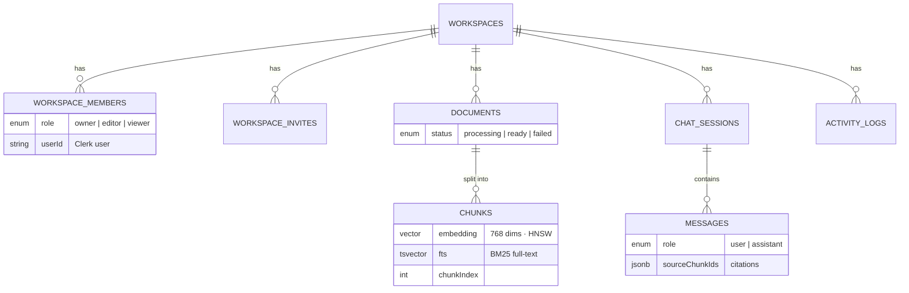

# IntelliVault

**Enterprise document intelligence — workspace-scoped hybrid RAG, streaming AI chat, and team collaboration.**

[](https://nextjs.org)
[](https://typescriptlang.org)
[](https://neon.tech)
[](https://clerk.com)
[](https://openai.com)
[](https://sdk.vercel.ai)

Upload documents into isolated team workspaces. Ask questions. Get answers grounded in your organization's actual knowledge — with role-based access, source citations, session history, and full auditability.

---

## Demo

<!-- 📽️ Add your demo video below — replace the src with your video URL or embed code -->
<!-- Option A: YouTube embed -->
<!--
<a href="YOUR_YOUTUBE_LINK_HERE">
  
</a>
-->

<!-- Option B: Direct video file (GitHub supports mp4 in README) -->
<!--
https://user-images.githubusercontent.com/YOUR_USER_ID/YOUR_VIDEO_FILE.mp4
-->

> 🎬 **[Watch the demo — coming soon]**

---

## Why IntelliVault

Most "chat with your PDF" demos are single-user, single-document, zero access control. IntelliVault is built like a product, not a demo:

| Problem with demos | IntelliVault's answer |
|---|---|
| No multi-tenancy | **Workspaces** — isolated containers, zero cross-tenant data access |
| No access control | **RBAC** — Owner / Editor / Viewer, enforced at the API layer on every route |
| Vector-only search misses exact terms | **Hybrid retrieval** — vector + BM25, fused with Reciprocal Rank Fusion |
| AI makes things up | **Grounded answers** — LLM only uses your documents, with source citations on every response |
| Chats disappear on refresh | **Persistent sessions** — conversations saved, titled automatically, and resumable |

---

## Features

| Feature | Description |
|---|---|
| **Workspace isolation** | Documents, chats, and members scoped per workspace — no cross-tenant leakage |
| **RBAC** | Owner / Editor / Viewer roles enforced on every API route |
| **Multi-format ingestion** | PDF, DOCX, TXT, and Markdown — parsed, chunked, embedded, and indexed automatically |
| **Contextual chunking** | Each chunk prefixed with document name + section heading before embedding — better retrieval without polluting display text |
| **Hybrid RAG search** | pgvector semantic search + Postgres BM25 full-text search, merged with Reciprocal Rank Fusion |
| **Query rewriting** | Follow-up questions ("what about section 3?") rewritten into standalone queries using conversation history |
| **Tool-calling agent** | LLM autonomously decides when to search the knowledge base |
| **Source citations** | Every answer shows which documents and chunks backed it |
| **LLM-as-judge evaluation** | Every response scored on context relevance, faithfulness, and answer relevance — surfaced in a per-workspace eval dashboard |
| **Session persistence** | Conversations saved to DB, titled by LLM, resumable from history |
| **Email invites** | Invite collaborators by email — works with or without an existing account |
| **Streaming responses** | Token-by-token streaming via Vercel AI SDK |
| **Toast notifications** | Sonner-powered feedback on every user action |
| **Audit logging** | Every workspace action logged with actor, timestamp, and metadata |

---

## How It Works

IntelliVault has two halves: an **ingestion pipeline** that turns raw documents into searchable knowledge, and a **retrieval pipeline** that answers questions from that knowledge. Both are scoped to a workspace at every step.

```mermaid
%%{init: {"theme":"base","themeVariables":{"fontFamily":"Inter, Segoe UI, sans-serif","fontSize":"13px","primaryColor":"#101113","primaryTextColor":"#e6e8ea","primaryBorderColor":"#2b2e34","lineColor":"#5a5f68","clusterBkg":"#0b0c0e","clusterBorder":"#1f2126","edgeLabelBackground":"#0b0c0e","titleColor":"#9ba1a6"},"flowchart":{"curve":"basis","nodeSpacing":38,"rankSpacing":46}}}%%
flowchart LR
    subgraph W ["  ingestion · write path  "]
        direction LR
        A(["document upload"]) --> B["extract & chunk"] --> C["embed + index"]
    end

    C --> D[("knowledge base\npgvector · tsvector")]

    subgraph R ["  retrieval · read path  "]
        direction LR
        E(["user question"]) --> F["hybrid search"] --> G["LLM synthesis"] --> H(["cited, streamed answer"])
    end

    D -. "workspace-scoped chunks" .-> F

    classDef entry stroke:#5e6ad2,stroke-width:1.5px
    classDef store fill:#15161b,stroke:#5e6ad2,stroke-width:1.5px
    classDef exit stroke:#3dd68c,stroke-width:1.5px
    class A,E entry
    class D store
    class H exit
```



---

## The RAG Pipeline

### 1 · Ingestion — documents in

Every uploaded document passes through this pipeline before it's searchable. Two indexes are built per chunk: a **768-dim embedding** (for meaning) and a **tsvector** (for exact keywords). Each chunk is **contextually enriched** with the document name and detected section heading before embedding — improving vector placement without altering the stored content.

```mermaid
%%{init: {"theme":"base","themeVariables":{"fontFamily":"Inter, Segoe UI, sans-serif","fontSize":"13px","primaryColor":"#101113","primaryTextColor":"#e6e8ea","primaryBorderColor":"#2b2e34","lineColor":"#5a5f68","edgeLabelBackground":"#0b0c0e"},"flowchart":{"curve":"basis","nodeSpacing":42,"rankSpacing":52}}}%%
flowchart TD
    A(["document upload\nPDF · DOCX · TXT · MD"]) --> B["text extraction\nunpdf · mammoth · raw"]
    B --> C["chunking\n1000 chars · 200 overlap"]
    C --> C2["contextual enrichment\ndoc name + section heading"]
    C2 --> D["semantic index\nGemini embedding · 768 dims"]
    C --> E["keyword index\nPostgres tsvector"]
    D --> F[("chunks\npgvector · HNSW")]
    E --> F
    F --> G(["document ready"])

    classDef entry stroke:#5e6ad2,stroke-width:1.5px
    classDef store fill:#15161b,stroke:#5e6ad2,stroke-width:1.5px
    classDef exit stroke:#3dd68c,stroke-width:1.5px
    class A entry
    class F store
    class G exit
```



### 2 · Retrieval — answers out

When a user asks a question, the query is **rewritten** for standalone clarity, then **two retrievers run in parallel** and their results are fused. Each is good at what the other is bad at:

| Retriever | Finds | Example |
|---|---|---|
| **Vector search** | Meaning & paraphrases | "car" ≈ "automobile", "leave policy" ≈ "vacation rules" |
| **BM25 full-text** | Exact tokens | Policy codes (`POL-SEC-014`), names, IDs, clause numbers |
| **RRF fusion** | Best of both | Chunks both retrievers rank highly float to the top |

```mermaid
%%{init: {"theme":"base","themeVariables":{"fontFamily":"Inter, Segoe UI, sans-serif","fontSize":"13px","primaryColor":"#101113","primaryTextColor":"#e6e8ea","primaryBorderColor":"#2b2e34","lineColor":"#5a5f68","edgeLabelBackground":"#0b0c0e"},"flowchart":{"curve":"basis","nodeSpacing":42,"rankSpacing":50}}}%%
flowchart TD
    A(["user question"]) --> QR["query rewrite\nstandalone from history"]
    QR --> B["LLM agent\ndecides to search"]
    B --> C["searchKnowledgeBase"]

    C --> D["vector search\ncosine similarity · top 20"]
    C --> E["BM25 full-text\nts_rank · top 20"]

    W["workspace_id filter\ntenant isolation"] -.- D
    W -.- E

    D --> F["reciprocal rank fusion\nΣ 1 / (60 + rank) → top 5"]
    E --> F

    F --> G["LLM synthesis\ngrounded in chunks only"]
    G --> H(["streamed answer + citations"])
    H --> EV["LLM-as-judge eval\nrelevance · faithfulness · answer"]
    EV --> I[("session history + scores")]

    classDef entry stroke:#5e6ad2,stroke-width:1.5px
    classDef fuse fill:#15161b,stroke:#5e6ad2,stroke-width:1.5px
    classDef guard fill:transparent,stroke:#2b2e34,stroke-dasharray:4 3,color:#9ba1a6
    classDef exit stroke:#3dd68c,stroke-width:1.5px
    classDef store fill:#15161b,stroke:#2b2e34
    class A entry
    class F fuse
    class W guard
    class H exit
    class I store
```



> **Why hybrid?** Pure vector search misses rare terms, IDs, and exact names. Pure keyword search has no idea two words mean the same thing. Fusing both ranked lists with RRF means a chunk that both retrievers agree on is almost certainly the right one.

---

## User Flow

```mermaid
%%{init: {"theme":"base","themeVariables":{"fontFamily":"Inter, Segoe UI, sans-serif","fontSize":"13px","primaryColor":"#101113","primaryTextColor":"#e6e8ea","primaryBorderColor":"#2b2e34","lineColor":"#5a5f68","edgeLabelBackground":"#0b0c0e","clusterBkg":"#0b0c0e","clusterBorder":"#1f2126","titleColor":"#9ba1a6"},"flowchart":{"curve":"basis","nodeSpacing":40,"rankSpacing":48}}}%%
flowchart LR
    A(["sign in\nClerk"]) --> B["dashboard"]
    B --> C{"workspace"}
    C -- create --> D["new workspace\nowner"]
    C -- invited --> E["accept invite\neditor · viewer"]
    D --> F["workspace home"]
    E --> F

    subgraph K ["  knowledge  "]
        direction TB
        G["upload PDF"] --> G2["auto-indexed\nprocessing → ready"]
    end

    subgraph T ["  chat loop  "]
        direction TB
        H["ask question"] --> H2["hybrid RAG search"] --> H3(["cited answer"])
        H3 -. "follow-up" .-> H
    end

    F --> K
    F --> T
    G2 -. "knowledge available" .-> H2
    H3 --> I[("session history\nresumable")]

    classDef entry stroke:#5e6ad2,stroke-width:1.5px
    classDef hub fill:#15161b,stroke:#5e6ad2,stroke-width:1.5px
    classDef exit stroke:#3dd68c,stroke-width:1.5px
    classDef store fill:#15161b,stroke:#2b2e34
    class A entry
    class F hub
    class H3 exit
    class I store
```



Members and settings round out the workspace: invite collaborators by email with a role, rename the workspace, or delete it behind a type-to-confirm danger zone — every action written to the audit log.

---

## Data Model



All workspace-child tables **cascade-delete** when the parent workspace is removed.

---

## Tech Stack

| Layer | Technology |
|---|---|
| Framework | Next.js 16 (App Router) · TypeScript 5 |
| Auth | Clerk |
| Database | Neon serverless PostgreSQL |
| Vector search | pgvector — cosine similarity + HNSW index |
| Keyword search | Postgres full-text search (`tsvector` / `ts_rank`) |
| ORM | Drizzle ORM |
| Embeddings | Google Gemini `gemini-embedding-001` (768 dims) |
| LLM | OpenAI `gpt-4o-mini` via Vercel AI SDK v6 |
| PDF parsing | unpdf |
| DOCX parsing | mammoth |
| Text splitting | LangChain `RecursiveCharacterTextSplitter` |
| Notifications | Sonner (toast) |
| Email | Resend + React Email |
| Styling | Tailwind CSS v4 · Linear-inspired design system |

---

## Getting Started

### Prerequisites

- Node.js 20+
- [Neon](https://neon.tech) database with the `pgvector` extension
- [Clerk](https://clerk.com) application
- [OpenAI](https://platform.openai.com) API key
- [Google AI Studio](https://aistudio.google.com) API key (for embeddings)
- [Resend](https://resend.com) API key (for email invites)

### 1 · Clone & install

```bash
git clone https://github.com/itsyashbisht/IntelliVault-Enterprise.git
cd IntelliVault-Enterprise
npm install
```

### 2 · Environment variables

Create `.env.local`:

```env
# Database
NEON_DATABASE_URL=postgresql://...

# Auth
NEXT_PUBLIC_CLERK_PUBLISHABLE_KEY=pk_test_...
CLERK_SECRET_KEY=sk_test_...

# AI
OPENAI_API_KEY=sk-...
GOOGLE_GENERATIVE_AI_API_KEY=AIza...

# Email
RESEND_API_KEY=re_...
NEXT_PUBLIC_APP_URL=http://localhost:3000
```

### 3 · Database setup

Run once in the Neon SQL editor:

```sql
CREATE EXTENSION IF NOT EXISTS vector;

CREATE TYPE workspace_role AS ENUM ('owner', 'editor', 'viewer');
CREATE TYPE invite_status   AS ENUM ('pending', 'accepted', 'expired');
CREATE TYPE document_status AS ENUM ('processing', 'ready', 'failed');
CREATE TYPE message_role    AS ENUM ('user', 'assistant');
```

Then push the schema:

```bash
npx drizzle-kit push
```

### 4 · Run

```bash
npm run dev
```

Open [http://localhost:3000](http://localhost:3000) — sign up, create a workspace, upload a PDF, and start asking questions.

---

## API Routes

| Route | Methods | Access |
|---|---|---|
| `/api/workspaces` | `POST` `GET` | Authenticated |
| `/api/workspaces/[id]` | `GET` `PATCH` `DELETE` | Member / Owner |
| `/api/workspaces/[id]/members` | `GET` `PATCH` `DELETE` | Member / Owner |
| `/api/workspaces/[id]/invites` | `POST` `GET` `DELETE` | Owner / Editor |
| `/api/workspaces/[id]/documents` | `POST` `GET` | Member |
| `/api/workspaces/[id]/documents/[docId]` | `DELETE` | Owner / Editor |
| `/api/workspaces/[id]/chat` | `POST` | Member |
| `/api/workspaces/[id]/chat/sessions` | `POST` `GET` | Member |
| `/api/workspaces/[id]/eval` | `GET` | Owner / Editor |
| `/api/invites/[token]` | `POST` | Authenticated |

---

## Project Structure

```
src/
├── app/
│   ├── (marketing)/          # Landing, sign-in, sign-up
│   ├── (app)/
│   │   ├── dashboard/        # Workspace switcher
│   │   └── workspace/[id]/
│   │       ├── documents/    # Upload + document list
│   │       ├── chat/         # RAG chat + session history
│   │       ├── eval/         # LLM-as-judge evaluation dashboard
│   │       ├── members/      # Member management + invites
│   │       └── settings/     # Rename + danger zone
│   └── api/                  # Workspace, document, chat, eval, invite routes
├── components/
│   ├── documents/            # UploadDropzone, DocumentTable, StatusBadge
│   ├── eval/                 # ScoreCard, SessionTable, WorstSessions
│   ├── marketing/            # Landing page components
│   ├── workspace-home/       # StatsCard, RecentDocuments, RecentChats
│   └── ai-elements/          # Chat UI primitives
├── schema/                   # Drizzle table definitions + relations
├── lib/
│   ├── search.ts             # Hybrid search: vector + BM25 + RRF fusion
│   ├── rewrite-query.ts      # Conversational query rewriting
│   ├── evals.ts              # LLM-as-judge scoring (context relevance, faithfulness, answer relevance)
│   ├── embedding.ts          # Gemini embedding generation
│   ├── chunking.ts           # LangChain text splitter + contextual enrichment
│   └── parsers/              # Multi-format document parsers (PDF, DOCX, TXT, MD)
└── emails/                   # React Email templates
```

---

## Roadmap

- [x] Hybrid search — pgvector + BM25 full-text, fused with Reciprocal Rank Fusion
- [x] Query rewriting — rewrite follow-up questions into standalone queries using conversation history
- [x] Contextual chunking — prepend document title + section heading to each chunk before embedding
- [x] Multi-format ingestion — PDF, DOCX, TXT, and Markdown with dedicated parsers
- [x] LLM-as-judge evaluation — score responses on faithfulness, context relevance, and answer relevance
- [x] Toast notifications — Sonner-powered feedback on every user action
- [ ] Re-ranking — cross-encoder re-ranker on retrieved chunks for better precision
- [ ] Agentic RAG — multi-step tool-use chains for complex multi-document reasoning

---

## License

Private project. All rights reserved.

---

Built by [Yash Bisht](https://github.com/itsyashbisht) · Next.js · pgvector · GPT-4o-mini · Gemini · Vercel AI SDK